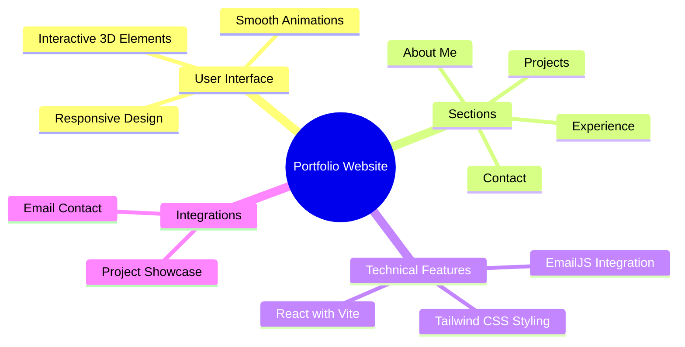

<div align="center">

![Banner]MovieHub

<p align="center">
  <a href="#features">Features</a> •
  <a href="#demo">Demo</a> •
  <a href="#screenshots">Screenshots</a> •
  <a href="#installation">Installation</a> •
  <a href="#tech-stack">Tech Stack</a>
</p>
[](https://reactjs.org)

<p align="center">A modern, responsive Movies and TV Series App in React, Vite, and Material UI.  ✨</p>

</div>

## ✨ Features

<div align="center">



</div>

## 🚀 Demo

Experience the live portfolio at [https://portfolio-lohit.vercel.app](https://portfolio-lohit.vercel.app)

## 🛠️ Installation

1️⃣ Clone the repository:

```bash
git clone https://github.com/darshiu/movieHub
```

2️⃣ Navigate to project directory:

```bash
cd movieHub
```

3️⃣ Install dependencies:

```bash
npm install
```

4️⃣ Run development server:

```bash
npm run dev
```

5️⃣ Open in browser:

- Visit [http://localhost:3000](http://localhost:3000)

## 💻 Tech Stack

<table align="center">
  <tr>
    <td align="center" width="96">
      
      <br>React
    </td>
      <td align="center" width="96">
      
      <br>Vite
    </td>
    <td align="center" width="96">
      
      <br>Material UI
    </td>
  </tr>
</table>
- 📱 MovieDB / TMDB API - 
- Website - https://developers.themoviedb.org/3
Create a .env file in your project root:

VITE_API_KEY=your_real_api_key_here
## ⚡ Core Features


